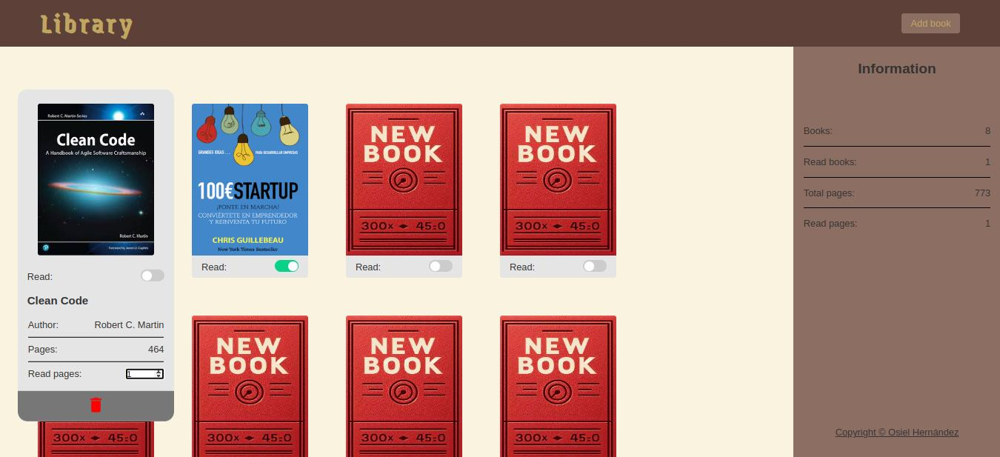

# Library

The Virtual Library project is a web-based application that allows users to create and manage a virtual book collection. The application provides a user-friendly interface for users to add, remove, and organize books, as well as track their reading status.

## Screenshots

## Link

## Features

The Virtual Library project includes the following features:

- **Book Addition**: Users can add new books to their collection by providing the book's title, author, cover image, pages and readed pages. They can also specify the book's reading status (read or unread).
- **Book Removal**: Users can remove books from their collection by clicking the "Remove" button next to the book's title.
- **Book Organization**: Books are organized in a list view, with each book displayed as a separate component. Users can scroll through the list to view their entire collection.
- **Book Info Panel**: When a user clicks on a book, an information panel appears, displaying the book's details; including title, author, cover image, pages, read pages and reading status.
- **Book Tracking**: Users can update a book's info(read pages and reading status) in the info panel of each book.

## Author

[Osiel Hernández](https://www.github.com/xXOsielXx)

